# Tasks for Module 2

1. Separate text from background [(images for task 1)](#textimages)
2. Estimate number of objects [(images for task 2)](#countimages)
3. Separate object from background [(images for task 3)](#objimages)
4. Find affine transformation matrix using 3 point pairs
5. Find projective transformation matrix using 4 point pairs
6. Implement PatchMatch algorithm

## Notes

**In task 4** correctness of solution can be verified using cv functions:

```
cv2.getAffineTransform(pts1,pts2)
cv2.warpAffine(img,M,img.shape[:2])
```

**In task 5** correctness of solution (up to scalar multiplier) can be verified using cv functions:

```
cv2.getPerspectiveTransform(pts1,pts2)
cv2.warpPerspective(img,M,(w, h))
```

**In task 6** you can use frames  [frames/v001.jpg](frames/v001.jpg) - [frames/v100.jpg](frames/v100.jpg) for testing.
You can downscale images to 25% of original size for faster processing.


## Assessment criteria

### Assessment criteria for day 1 tasks (1-3):

IMPORTANT! Students are not expected to find unique solution that works in all cases.

Just try to do your best.

FAIR - working solutions customized for every image. >70% solved tasks (17-21 images ).

GOOD - working solutions customized for every image. >90% solved tasks (22-24 images).

EXCELLENT - solution that handles one of image sets with a single set of parameters. 100% solved tasks for other sets.

For separation of text from background correct solution should set text to black and background to white in the following areas:

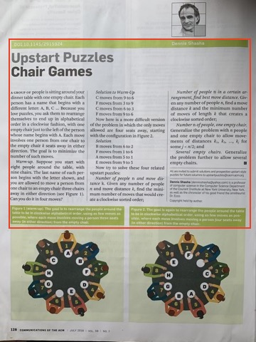

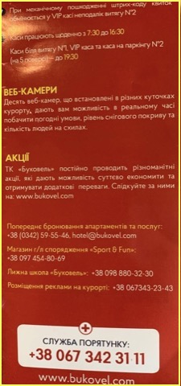
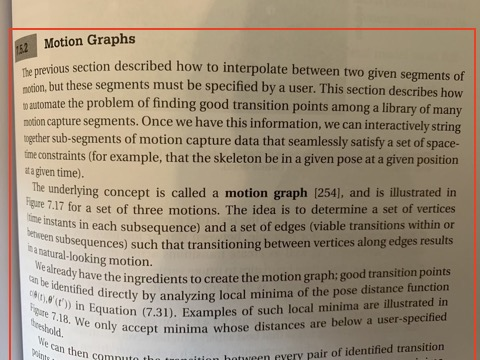
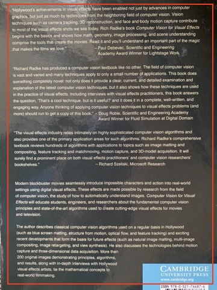


some amount of noise and small spots are allowed.

You can pass rectangles with text to algorithm, but separation and text/background decision should be done automatically.

For EXCELLENT mark text rectangles should be automatocally detected (you can use open-source software for that or search for rectanges with proper statistics (ratio between background and foreground and ratio of edges) )

For object counting 5% error is allowed.

For object separation from background 5% of missclassification is allowed (5% of total image area can be false positives of false negatives)

### Assessment criteria for day 2 tasks (4-6):

FAIR - only tasks 4 and 5 are solved

GOOD - tasks 4,5,6 are solved. Patch Match algorithm processing time is more than 3 sec for 320x180 images

EXCELLENT - tasks 4,5,6 are solved. Patch Match algorithm processing time is less than 3 sec for 320x180 images

(Time will be estimated using computer with 2.9 GHz Intel Core i5, GPU usage is not allowed for this task)

## <a name="textimages"></a> Separate text from background


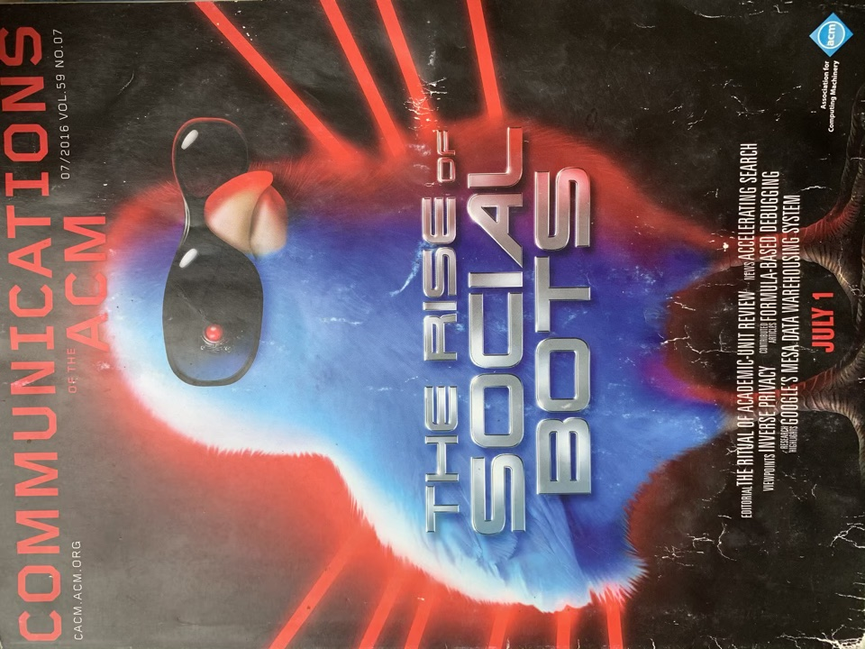

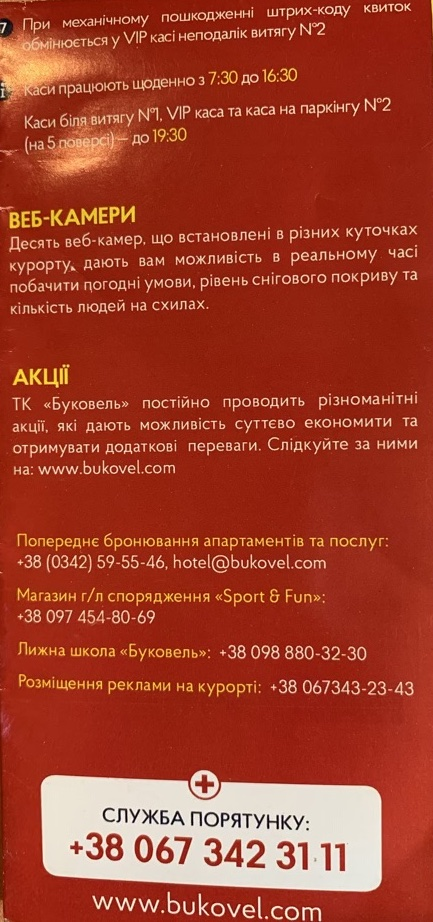

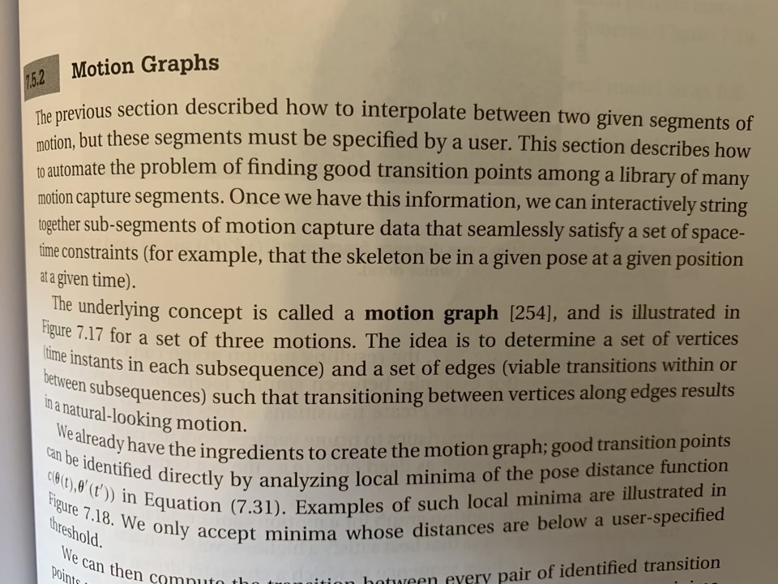


## <a name="countimages"></a> Estimate number of objects

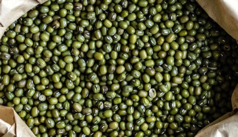

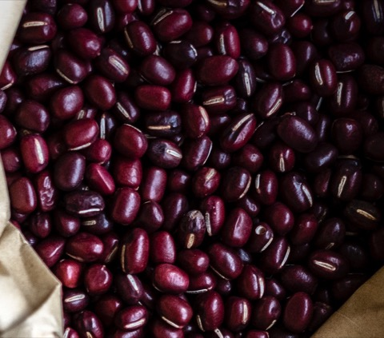


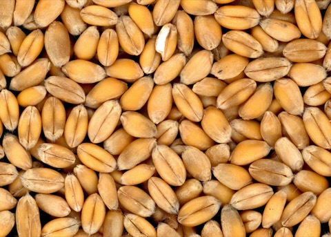

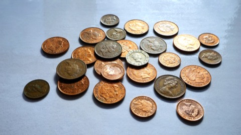

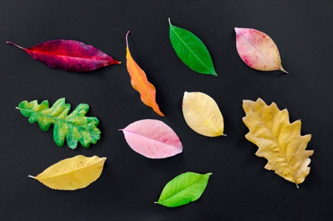

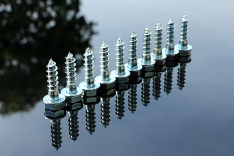


## <a name="objimages"></a> Separate objects from background


